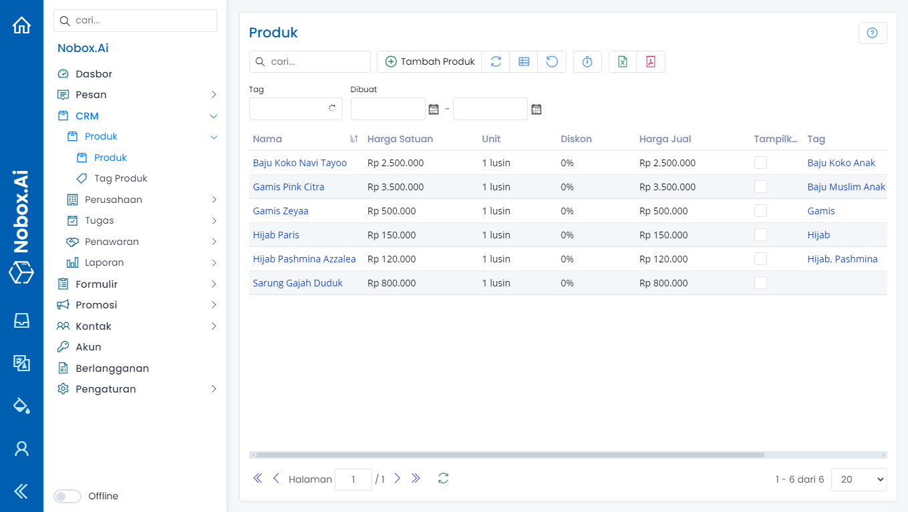

# Produk

Produk adalah salah satu menu pada NoBox.Ai yang digunakan untuk manajemen data produk yang dijual.



<figure><figcaption></figcaption></figure>

## **Tambah Produk**

Untuk membuat data produk, silahkan klik menu **\[Produk] ➔ \[Tambah Produk]**. Maka akan tampil dialog **\[Tambah Produk]**, kemudian lengkapi isian-isian yang terdapat pada dialog tersebut.

<figure><figcaption></figcaption></figure>

| Nama        | Nama Produk                       | Lampu Hias            |
| ----------- | --------------------------------- | --------------------- |
| Kode Produk | Kode Produk                       | 00010                 |
| Unit        | Satuan Produk                     | Pcs                   |
| Mata Uang   | Mata Uang dan Nominal Harga       | Rp.15.000             |
| Diskon      | Diskon untuk produk               | 15                    |
| Harga Jual  | Hasil dari harga yang di diskon   | 12.750                |
| Manufaktur  | Nama Industri Produk              |                       |
| Tag         | Tag Produk                        | Elektronik            |
| Kategori    | Kategori Produk                   | Perlengkapan Natal    |
| Deskripsi   | Deskripsi Produk                  | Lampu Hias Yang Indah |
| Aktif       | Mengaktifkan/Menonaktifkan Produk | Aktif                 |
| Gambar      | Gambar Produk                     |                       |

\
Jika Anda sudah melengkapi isian-isian yang ada, klik **\[Simpan]** untuk menyimpan data produk yang baru saja Anda buat.

## **Edit dan Hapus Data Produk**

Untuk mengedit suatu data produk, silahkan pilih terlebih dahulu data mana yang akan diedit. Editlah data Anda dan klik **\[Simpan]** untuk menyimpan perubahan tersebut. Untuk menghapus suatu data produk adalah dengan pilih data produk yang akan dihapus, kemudian klik **\[Hapus]** maka akan tampil dialog konfirmasi apakah Anda ingin menghapus data tersebut. Jika ya, klik **\[Ya]** jika tidak klik **\[Tidak]**.

***

Jika ada masalah atau kesulitan terkait NoBox.Ai, silahkan hubungi kami melalui [Support Ticket](https://crm.nobox.ai/clients/tickets)
