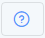
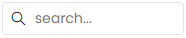
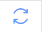
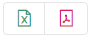
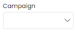

# Tampilan NoBox AI



Pada website NoBox.Ai memiliki beberapa tampilan umum yaitu :

## **Dasbor**

Berisikan ringkasan informasi aktivitas secara real time dan dapat mempermudah Anda untuk mengambil keputusan

<figure><figcaption></figcaption></figure>

Dalam tampilan dasbor terdapat fitur umum yang punya fungsi masing-masing. Penjelasan dari fungsi tersebut adalah sebagai berikut :

<table><thead><tr><th width="133">Fitur/Tombol</th><th>Fungsi</th></tr></thead><tbody><tr><td></td><td>Filter data dasbor periode per tahun</td></tr><tr><td></td><td>Merefresh data di dasbor secara otomatis setiap 10 detik</td></tr><tr><td></td><td>Menampilkan bantuan atau knowledge base</td></tr><tr><td></td><td>Menampilkan data grafik secara fullscreen</td></tr></tbody></table>

## **Kanban**

Salah satu metode dalam manajemen proyek dengan cara membuat visualisasi menggunakan papan, kolom, dan kartu untuk mengelola tugas dan alur kerja secara efektif.

<figure><figcaption></figcaption></figure>

Dalam tampilan kanban terdapat fitur umum yang punya fungsi masing-masing. Penjelasan dari fungsi tersebut adalah sebagai berikut :

<table><thead><tr><th width="161.79998779296875">Fitur/Tombol</th><th>Fungsi</th></tr></thead><tbody><tr><td>Papan</td><td>Memilih data projek yang telah dibuat yang akan ditampilkan pada kanban</td></tr><tr><td>Filter</td><td>Filter data kanban berdasarkan filter data yang tersedia</td></tr><tr><td>Cari</td><td>Pencarian data sesuai dengan kata kunci</td></tr><tr><td>Kanban</td><td>Menampilkan spesifikasi alur kerja</td></tr></tbody></table>

## **List**

Tampilan yang berisi suatu daftar data yang sudah dibuat pada menu-menu tertentu.

<figure><figcaption></figcaption></figure>

Dalam tampilan list terdapat fitur umum yang punya fungsi masing-masing. Penjelasan dari fungsi tersebut adalah sebagai berikut :

<table><thead><tr><th width="141.79998779296875">Fitur/Tombol</th><th>Fungsi</th></tr></thead><tbody><tr><td></td><td>Pencarian data sesuai dengan kata kunci</td></tr><tr><td> </td><td>Refresh data</td></tr><tr><td> </td><td>Menampilkan atau menyembunyikan kolom pada grid</td></tr><tr><td> </td><td>Mengembalikan tampilan kolom sesuai dengan tampilan default</td></tr><tr><td> </td><td>Export data berupa Excel atau PDF</td></tr><tr><td></td><td>Merefresh data di dashboard secara otomatis setiap 10 detik</td></tr><tr><td></td><td>Menampilkan bantuan atau knowledge base</td></tr><tr><td></td><td>Filter data sesuai dengan judul filter</td></tr></tbody></table>

## **Formulir**

Tampilan yang berfungsi untuk menambahkan data baru atau untuk mengedit data.

<figure><figcaption></figcaption></figure>

Dalam tampilan form terdapat fitur umum yang punya fungsi masing-masing. Penjelasan dari fungsi tersebut adalah sebagai berikut :

<table><thead><tr><th width="135.4000244140625">Fitur/Tombol</th><th>Fungsi</th></tr></thead><tbody><tr><td>Grup</td><td>Mengelompokan beberapa isian sesuai bagiannya</td></tr><tr><td>Simpan</td><td>Menyimpan data yang baru saja ditambahkan atau data yang sudah diedit</td></tr><tr><td>Continue</td><td>Menyimpan data yang baru saja ditambahkan atau data yang sudah diedit tanpa menutup dialog</td></tr><tr><td>Hapus</td><td>Menghapus data</td></tr></tbody></table>

***

Jika ada masalah atau kesulitan terkait NoBox.Ai, silahkan hubungi kami melalui [Support Ticket](https://crm.mynobox.com/clients/tickets)
